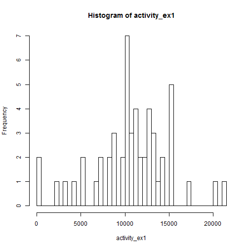
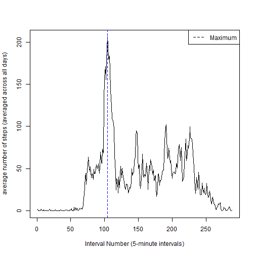
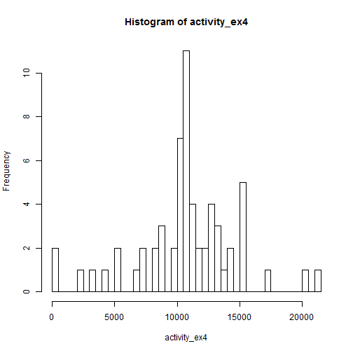
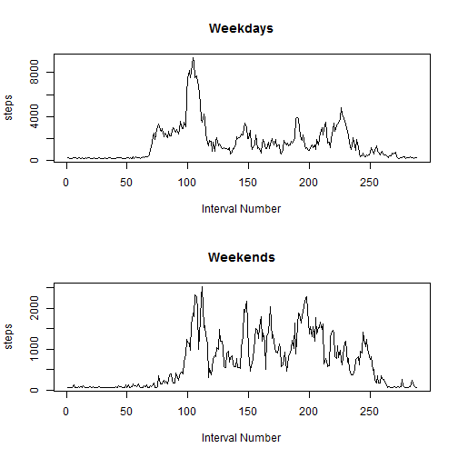

# Reproducible Research Peer Ass. 1

First, load data into R 


```r
setwd("C:/DATA/PROJECTS/2015 Data Science/05_reproducibleresearch/peerassessment1")
activity <- read.csv("activity.csv", header=TRUE, sep = ',',  stringsAsFactors=FALSE)
# str(activity) # 17568 obs, date has 61 levels (=days). 17568/61 = 288 intervals. 
# 288*5 = 1440. 1440/60 = 24. Every day has 24h, divided into 288 5min intervals
```

Process/transform the data (if necessary) into a format suitable for your analysis


```r
activity$date <- as.Date(activity$date)
```

What is mean total number of steps taken per day? (ignoring missing values)

1. Make a histogram of the total number of steps taken each day

```r
activity_ex1 <- na.omit(activity)
activity_ex1 <- tapply(activity_ex1$steps, activity_ex1$date, sum)
dim(activity_ex1) # 53 = number of days without NAs
```

```
## [1] 53
```

```r
hist(activity_ex1, breaks = 53) # 53 days 
```

 

```r
# Note: barplot(activity_ex1) # would represent number of steps chronologically, informative
```

2. Calculate and report the mean and median total number of steps taken per day

```r
activity_ex2 <- na.omit(activity)
activity_ex2 <- tapply(activity_ex2$steps, activity_ex2$date, sum)
# Note: smarter way to temporarily exclude NA: mean(vector,na.remove=TRUE)
mean(activity_ex2) # 10766.19
```

```
## [1] 10766.19
```

```r
#abline(v = mean(activity_ex2), lty=1, lwd=1, col="red") # to add line to histogram 
median(activity_ex2) # 10765
```

```
## [1] 10765
```

```r
#abline(v = median(activity_ex2, na.rm=TRUE), lty=1, lwd=1, col="blue")
```
Mean and median total number of steps per day are 10766.19 and 10765, respectively 

What is the average daily activity pattern?

1. Make a time series plot (i.e. type = "l") of the 5-minute interval (x-axis) and the average number of steps taken, averaged across all days (y-axis)


```r
activity_ex2 <- na.omit(activity)
activity_ex2 <- tapply(activity_ex2$steps, activity_ex2$interval, mean) 
plot(activity_ex2 , type = "l", ylab = "average number of steps (averaged across all days)", xlab = "Interval Number (5-minute intervals)") 
abline(v = which.max(activity_ex2), lty=2, lwd=1, col="blue")
legend("topright", lty=2, lwd=1, col="black", legend="Maximum")
```

 

```r
# barplot(activity_ex2) # Note: barplot shows chronologically over 24 hours
```

2. Which 5-minute interval, on average across all the days in the dataset, contains the maximum number of steps?


```r
activity_ex2 <- na.omit(activity)
activity_ex2 <- tapply(activity_ex2$steps, activity_ex2$interval, mean)
which.max(activity_ex2) # 835, 104 
```

```
## 835 
## 104
```

```r
activity_ex2_max <- activity_ex2[which.max(activity_ex2)]
# activity_ex2[104] #      835, 206.1698 
activity_ex2_max #    835 (=8.35am), 206.1698 
```

```
##      835 
## 206.1698
```
It is the 104th interval, starting at 8.35am, presumably when people are on their way to work.
The average number of steps during that interval is 206.17 

Imputing missing values

Note that there are a number of days/intervals where there are missing values (coded as NA). The presence of missing days may introduce bias into some calculations or summaries of the data.

1. Calculate and report the total number of missing values in the dataset (i.e. the total number of rows with NAs)

```r
activity_ex3 <- na.omit(activity)
nrow(activity) - nrow(activity_ex3) # 2304 
```

```
## [1] 2304
```

```r
# 2nd way: nrow(activity[is.na(activity), ]) # 2304 
```
Total number of rows with NAs is 2304 


2. Devise a strategy for filling in all of the missing values in the dataset. The strategy does not need to be sophisticated. For example, you could use the mean/median for that day, or the mean for that 5-minute interval, etc.

In line with statistical science, we take a statistical approach. 
The chosen strategy consists of replacing NAs with the mean number of steps over all days. 
An alternative statistical strategy could consist of replacing NAs with the most frequently occurring value. That value is the mode. Calculation added below for completeness. 


```r
activity <- read.csv("activity.csv", header=TRUE, sep = ',',  stringsAsFactors=FALSE)
#mean(activity_ex2) # 37.3826 
activity[is.na(activity)] <- mean(activity_ex2)
# Alternative Strategy
# Function to calculate mode 
#mode <- function(x) {
#  ux <- unique(x)
#  ux[which.max(tabulate(match(x, ux)))]
#}
#mode(activity$steps) # 0 
#activity[is.na(activity)] <- mode(activity$steps) 
```

3. Create a new dataset that is equal to the original dataset but with the missing data filled in.

```r
activity_new <- activity
```

4. Make a histogram of the total number of steps taken each day and Calculate and report the mean and median total number of steps taken per day. Do these values differ from the estimates from the first part of the assignment? What is the impact of imputing missing data on the estimates of the total daily number of steps?


```r
activity_ex4 <- tapply(activity_new$steps, activity_new$date, sum)
hist(activity_ex4, breaks = 53) 
```

 

As far as the histogram is concerned, there is a virtually no difference in structure.  


```r
activity_ex4_mean <- tapply(activity_new$steps, activity_new$date, sum)
mean(activity_ex4_mean) # Result: 10766.19
```

```
## [1] 10766.19
```

As far as the mean is concerned, there is no impact of replacing missing data with mean. It stays same as before with 10766.19. Expected, since filling NAs with mean and averaging that results in same mean as before.    


```r
activity_ex4_median <- tapply(activity_new$steps, activity_new$date, sum)
median(activity_ex4_median) # 10766.19
```

```
## [1] 10766.19
```

As far as the median is concerned, there is a slight impact of replacing missing data with mean. It went up from 10675 to 10766.19, same as mean. Expected, since there are 2304 more values equal to mean, making it more likely that mean and median are same.    


Are there differences in activity patterns between weekdays and weekends?

For this part the weekdays() function may be of some help here. Use the dataset with the filled-in missing values for this part.

1. Create a new factor variable in the dataset with two levels – “weekday” and “weekend” indicating whether a given date is a weekday or weekend day.

 

```r
activity1 <- activity
activity1$date <- as.Date(activity1$date)
activity1$date <- weekdays(activity1$date)  

for (i in 1:length(activity1$date)) {
      if(activity1$date[i] == "Saturday" | activity1$date[i] == "Sunday") {
            activity1$date[i] <- "weekend"
      } else {
            activity1$date[i] <- "weekday"
      }
}
# test if replacement worked correctly: head(activity1,20)
# convert date into factor 
activity1$date <- factor(activity1$date)
# test if conversion worked properly: # levels(activity1$date)
# Alternative: vectorized (more efficient)
#activity1$date[weekdays(activity1$date) == "Sunday" | weekdays(activity1$date) == "Saturday"] <- "weekend"
```

2. Make a panel plot containing a time series plot (i.e. type = "l") of the 5-minute interval (x-axis) and the average number of steps taken, averaged across all weekday days or weekend days (y-axis). The plot should look something like the following, which was creating using simulated data:


```r
weekdays <- subset(activity1, date == "weekday")
weekends <- subset(activity1, date == "weekend")
weekdays <- tapply(weekdays$steps, weekdays$interval, sum)
weekends <- tapply(weekends$steps, weekends$interval, sum)
par(mfrow=c(2,1))
plot(weekdays, type = "l", ylab = "steps", xlab = "Interval Number", main="Weekdays") 
plot(weekends, type = "l", ylab = "steps", xlab = "Interval Number", main="Weekends") 
```

 

The plots show that people get up earlier on weekdays, and sleep in on weekends. 
During the day on weekdays, people presumably sit more while on weekends, people 
walk more spread throughout the day. 


 
